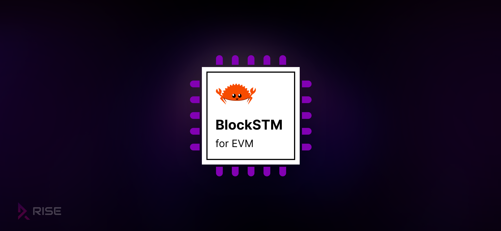
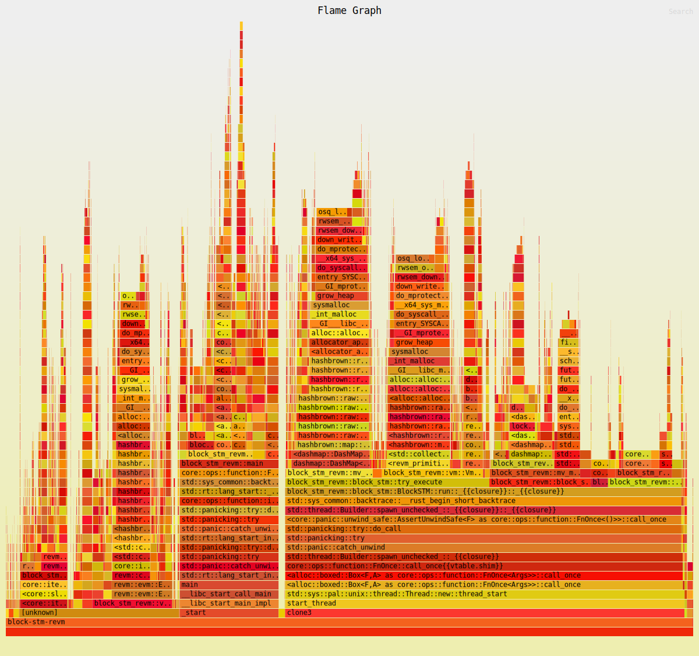
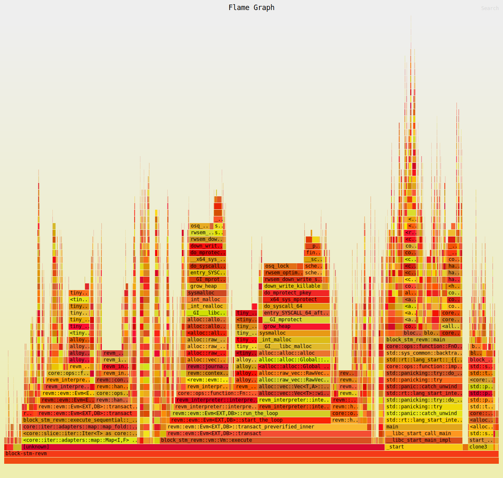

# Block-STM-REVM


Blazingly fast [Block-STM](https://arxiv.org/abs/2203.06871) implementation for EVM in Rust.

:warning: This repository is a **work in progress** and is **not production ready** :construction:



Block-STM is **a parallel execution engine for Blockchain transactions** built on the principles of Software Transactional Memory. Since Blockchain transactions are inherently sequential, a parallel execution engine must detect dependencies and avoid conflicts to guarantee the same deterministic outcome with sequential execution. Block-STM optimistically executes transactions and re-executes when conflicts arise using a collaborative scheduler and a multi-version shared data structure. Since it does not require prior knowledge or constraints on the input transactions, **replacing an existing sequential executor with Block-STM is easy for substantial performance boosts**.

Block-STM was initially designed for the Aptos blockchain that runs MoveVM. We must consider several factors to make it work well with EVM. For instance, all EVM transactions in the same block read and write to the same beneficiary account for gas payment, making all transactions interdependent by default. We must carefully monitor reads to this beneficiary account (defined in the block header) to update it atomically or outside the core transaction execution when there are no conflicts. Polygon has already adapted a version of Block-STM for EVM in their Go node. Our implementation is written in Rust, specifically on [revm](https://github.com/bluealloy/revm), to aim for even higher runtime performance without garbage collection. These performance improvements are critical to syncing chains with a massive state, building blocks for low-block-time chains, and ZK provers.

Finally, while Aptos and Polygon embed their Block-STM implementation directly into their nodes, **this dedicated repository provides both robust versions and a playground for further advancements**. For instance, we can introduce static-analysed metadata from an optimised mempool, track read checkpoints to re-execute from there instead of re-executing the whole transaction upon conflicts, and hyper-optimise the implementation at low system levels.

## Goals

- Become the fastest EVM (block) execution engine for rapid block building and syncing.
- Complete a robust version that passes all the relevant [ethereum/tests](https://github.com/ethereum/tests).
- Design more tests for larger blocks with complex state transitions and dependencies (ERC-20 and Uniswap transactions, etc.); contribute upstream if appropriate.
- Provide deep benchmarks to showcase improvements and support new developments.
- Get integrated into Ethereum clients and ZK provers like [Reth](https://github.com/paradigmxyz/reth), [Helios](https://github.com/a16z/helios), and [Zeth](https://github.com/risc0/zeth) to help make the Ethereum ecosystem blazingly fast.

## Development

### V1 TODO

- Properly handle the block's beneficiary account, which makes all transactions interdependent when paying gas. We should distinguish beneficiary reads from execution reads (like `address` and `balance` opcodes) so we can defer or atomically update the beneficiary balance. We may pass in a custom `PostExecutionHandler::reward_beneficiary` to solve this.
- Properly check for changed account infos in `revm`'s `ResultAndState` before adding them to the write set.
- Complete a robust version that passes all the relevant [ethereum/tests](https://github.com/ethereum/tests).
- Design more tests for larger blocks with complex state transitions and dependencies (ERC-20 and Uniswap transactions, etc.); contribute upstream if appropriate.
- Provide deep benchmarks, including a [Reth](https://github.com/paradigmxyz/reth) integration for syncing & building blocks.
- Robust error handling.
- Better and more modular "memory location" control to maximise performance.
- Better and more modular concurrency control to maximise performance.
- Better structure, types, and API for integration.

### V2 TODO

- Add pre-provided metadata from a statically analysed mempool or upstream nodes.
- Track read checkpoints to re-execute from there instead of re-executing the whole transaction upon conflicts.
- Hyper-optimise the implementation at low system levels.

### Profiling

```
$ cargo install flamegraph
$ cargo flamegraph
```

- 500k independent raw transfers:



- 500k independent ERC-20 transfers on an Intel i9 with 24 CPUs:

|                | Execution Time                    |
| -------------- | --------------------------------- |
| **Sequential** | 3.40770298s                       |
| **BlockSTM**   | 979.707789ms (~3.48 times faster) |


