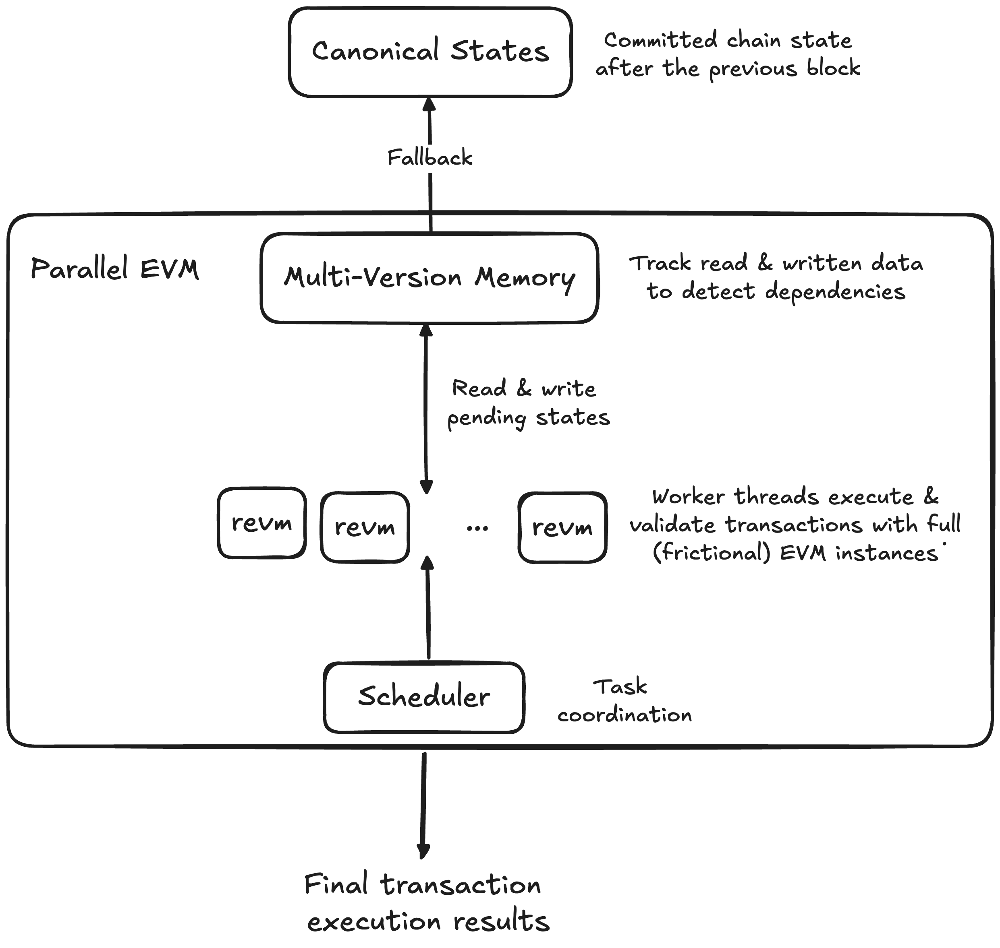
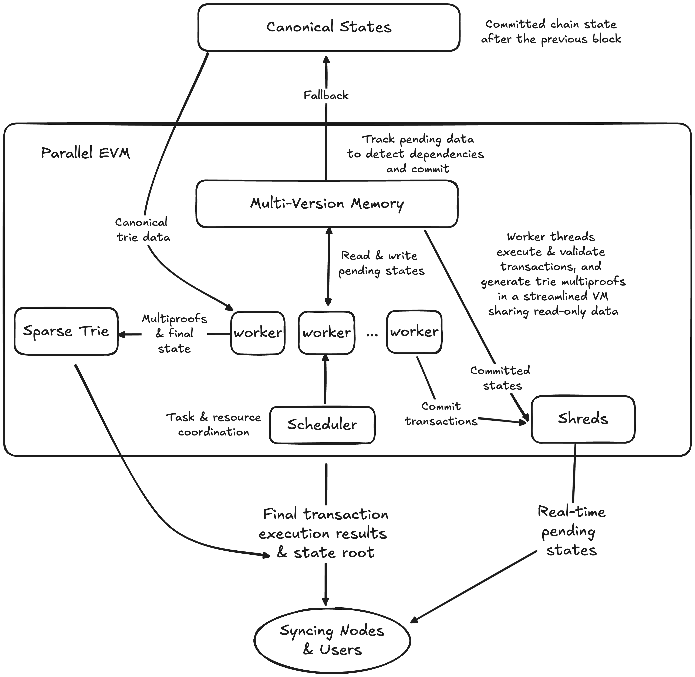

# RISE Parallel EVM

[](https://github.com/risechain/pevm/actions/workflows/ci.yml)

:warning: This repository is a **work in progress** and is **not production ready** :construction:

## Problems

### Throughput

Parallelising **transaction execution** to accelerate blockchain throughput has gained popularity thanks to Aptos and Solana. However, it is still unfruitful in the EVM land. Early adaptations of [Block-STM](https://arxiv.org/abs/2203.06871) by Polygon and Sei have shown limited speedup due to the lack of EVM-specific optimisations and implementation limitations. Both Polygon and Sei use Go, a garbage-collected language unsuitable for optimisations at the microsecond scale. Parallel execution in Go is mostly slower than sequential execution in Rust and C++ for Ethereum mainnet blocks today.

Furthermore, depending on the state size & transaction pattern, **state root calculation** can be even slower than transaction execution. Even with perfect pipelining (like RISE's Continuous Block Pipeline) that allows transaction execution and state root calculation to approach a block time each, if state root calculation goes over a block time, transaction execution actually needs to slow down, having to execute way below the physical CPU’s capability.

These two form the high-level bottleneck to blockchain throughput -- how many state transitions can we execute and merkelise in a block time?

### Latency

With sequential execution, assuming a transaction needs 100μs to execute and broadcast the result via shred, the 1000th order in a block will need to wait for 100ms. This is very unfortunate, especially for completely independent transactions.

Ideally, independent transactions would be executed in parallel and broadcast together with the same latency, even when they are serialised in order in a block.

## Solution

RISE pevm sets to address this problem by designing an **ultimate EVM engine that efficiently executes transactions, broadcasts results, and calculates the state root in parallel**; tightly implemented in Rust for minimal runtime overheads.

The engine dynamically identifies transaction parallelism without requiring developers to change anything (like explicitly declaring access states in Solana and Sui). Regardless, dApps do need to innovate new parallel designs to get more out of the parallel engine, like [Sharded AMM](https://arxiv.org/abs/2406.05568) and RISE's upcoming novel CLOB; just like how multiprocessors gave rise to the design of multithreaded programs.

When the transaction parallelism level is below the number of CPUs (very common for old dApp designs), the scheduler can schedule the idle workers to start generating multiproofs for states that have been updated this block, and use that to progressively calculate the state root with a sparse trie. Blazingly fast state root calculation will allow the transaction executor to not hold back and execute as fast as the physical CPUs can, and significantly reduce the latency of canonical blocks and states.

Parallel EVM commits parallel transactions in batches as they are validated. The RISE sequencer will broadcast each batch as a shred with a derived multi-version memory for full nodes to quickly sync all transactions and calculate the state root in parallel, enabling real-time pending states. With Parallel EVM, several users can now receive instant receipts at once, instead of having to wait sequentially!

## Design

Blockchain execution must be deterministic so that network participants can agree on blocks and state transitions. Therefore, parallel execution must arrive at the same outcome as sequential execution. Having race conditions that affect execution results would break consensus.

### Legacy

RISE pevm started out with Block-STM's optimistic execution, with a collaborative scheduler and a multi-version data structure to detect state conflicts and re-execute transactions accordingly.



We made several contributions fine-tuned for EVM. For instance, all EVM transactions in the same block read and write to the beneficiary account for gas payment, making all transactions interdependent by default. RISE pevm addresses this by lazy-updating the beneficiary balance. We mock the balance on gas payment reads to avoid registering a state dependency and only evaluate it at the end of the block or when there is an explicit read. We apply the same technique for common scenarios like raw ETH and ERC-20 transfers. Lazy updates help us parallelise transfers from and to the same address, with only a minor post-processing latency for evaluating the lazy values.

The initial result was decent -- 2x faster than sequential execution on average for Ethereum blocks, and 22x faster than sequential execution for a Gigagas block of independent Uniswap swaps. However, it wasn't good enough to justify complex node integrations.

### New

As we worked on our continuous block pipeline, shreds, and Reth's parallel sparse trie, we eventually found ways to innovate Parallel EVM way beyond what BlockSTM originally proposed.



Specifically:

- We replace `revm` with an inline EVM implementation that is "parallel-aware" to minimise VM overheads and maximise (readonly) data sharing.
- We add shreds to broadcast pending states per committed transactions in real-time.
- We add a Sparse Trie to calculate the state root in parallel.
- We extend the scheduler to also schedule shred committing and multiproof tasks, with a new design that is highly resource-aware.

With these, we will finally have the ultimate EVM engine that pushes throughput further, minimises latency for parallel transactions, and produces a state root blazingly fast.

## Goals

- Become the fastest EVM (block) engine for rapid block building and syncing.
- Provide deep tests and audits to guarantee safety and support new development.
- Provide deep benchmarks to showcase improvements and support new development.
- Complete a robust version for building and syncing blocks for RISE.
- Get integrated and implemented in more EVM clients to make the whole EVM ecosystem blazingly fast.

## Development

- Install [cmake](https://cmake.org) to build `snmalloc` (a highly performant memory allocator).

```sh
$ cargo build
```

### Done

- Build a Block-STM foundation to improve on.
- Lazily update gas payments to the beneficiary account as implicit reads & writes.
- Lazily update raw transfer senders & recipients as implicit reads & writes.
- Improve scheduler design & aggressively find tasks to save scheduling cycles.
- Many low-level optimisations.
- Complete foundation test & benchmark suites.

### TODO

- Implement an inline parallel-optimal EVM to replace `revm`.
- Lazily update ERC-20 transfers.
- Committing and broadcasting shreds.
- Parallel Spare Trie for state root calculation.
- More low-hanging fruit optimisations.
- Extended scheduler design.
- Robust error handling.
- Better types and API for integration.
- Integration into RISE nodes.

### Other Plans

- Optimise concurrent data structures to maximise CPU cache and stack memory.
- Optimise the scheduler & worker threads to minimise synchronisation.
- Add pre-provided metadata (DAG, states to preload, etc.) from a statically analysed mempool and upstream nodes.
- Custom purpose-tuned memory allocators.
- Track read checkpoints to re-execute from instead of re-executing the whole transaction upon conflicts.
- Hyper-optimise at low system levels (kernel configurations, writing hot paths in Assembly, etc.).
- Propose an EIP to "tax" blocks with low parallelism.

### Tooling

#### Fetch Real Blocks

We often want to fetch real blocks for testing and benchmarking. The `pevm-fetch` CLI snapshots everything needed to execute an Ethereum mainnet block to `data`. More networks will be supported in the future.

```sh
$ cargo run -p pevm-fetch <RPC_URL> <BLOCK_ID>
```

Where `<BLOCK_ID>` may be a hash or a number.

## Testing

We have three test groups:

- [ethereum/tests](https://github.com/ethereum/tests)'s [general state tests](crates/pevm/tests/ethereum/main.rs).
- Mocked blocks: [raw transfers](crates/pevm/tests/raw_transfers.rs), [erc20](crates/pevm/tests/erc20/main.rs), [uniswap](crates/pevm/tests/uniswap/main.rs), [mixed](crates/pevm/tests/mixed.rs), [beneficiary](crates/pevm/tests/beneficiary.rs), and [small blocks](crates/pevm/tests/small_blocks.rs).
- [Ethereum mainnet blocks](crates/pevm/tests/mainnet.rs).

```sh
$ git submodule update --init
# Running our heavy tests in parallel would congest resources.
# Each test still executes parallelly anyway.
$ cargo test --workspace --release -- --test-threads=1
```

## Benchmarks

See the dedicated doc [here](./crates/pevm/benches/README.md).

---

:exclamation: While others embed their parallel executor directly into their nodes, we build this dedicated repository as a playground for constant Parallel EVM R&D. Come join us, we are very contributor-friendly!
