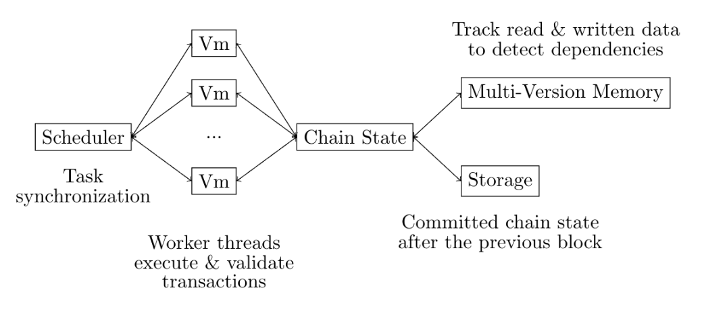

# RISE Parallel EVM


:warning: This repository is a **work in progress** and is **not production ready** :construction:


## Problem

**Parallelising execution** to accelerate blockchain throughput has gained popularity thanks to Aptos and Solana. However, it **is still unfruitful in the EVM land**. Early adaptions of [Block-STM](https://arxiv.org/abs/2203.06871) by Polygon and Sei have shown limited speedup due to the lack of EVM-specific optimisations and implementation limitations. Both Polygon and Sei use Go, a garbage-collected language unsuitable for optimisations at the micro-second scale. Parallel execution in Go is mostly slower than sequential execution in Rust and C++ for Ethereum mainnet blocks today.

## Solution

**RISE pevm** sets to address this problem by designing an **EVM-specialized parallel executor** and implementing it in Rust to minimise runtime overheads. The result is the **fastest EVM block executor**, with a peak speedup of 22x and a raw execution throughput of 30 Gigagas/s on 32 AWS Graviton3 CPUs. RISE pevm also **enables new parallel dApp designs for EVM** like [Sharded AMM](https://arxiv.org/abs/2406.05568).

## Design

Blockchain execution must be deterministic so that network participants agree on blocks and state transitions. Therefore, parallel execution must arrive at the same outcome as sequential execution. Having race conditions that affect execution results would break consensus.

RISE pevm builds on Block-STM's optimistic execution. We also use a collaborative scheduler and a multi-version data structure to detect state conflicts and re-execute transactions accordingly.



We made several contributions fine-tuned for EVM. For instance, all EVM transactions in the same block read and write to the beneficiary account for gas payment, making all transactions interdependent by default. RISE pevm addresses this by lazy-updating the beneficiary balance. We mock the balance on gas payment reads to avoid registering a state dependency and only evaluate it at the end of the block or when there is an explicit read. We apply the same technique for common scenarios like raw ETH and ERC-20 transfers. Lazy updates help us parallelise transfers from and to the same address, with only a minor post-processing latency for evaluating the lazy values.

While others embed their parallel executor directly into their nodes, we built this dedicated repository to serve as a playground for further pevm R&D.

## Goals

- **Become the fastest EVM (block) execution engine** for rapid block building and syncing.
- Provide deep tests and audits to guarantee safety and support new developments.
- Provide deep benchmarks to showcase improvements and support new developments.
- Complete a robust version for syncing and building blocks for RISE, Ethereum, and more EVM chains.
- Get integrated into Ethereum clients like [Reth](https://github.com/paradigmxyz/reth) to help make the Ethereum ecosystem blazingly fast.

## Development

> :warning: **Warning**
> pevm is performing poorly in recent Linux kernel versions. We noticed huge performance degradation after updating a machine to Ubuntu 24.04 with Linux kernel 6.8. The current suspect is the new EEVDF scheduler, which does not go well with pevm's scheduler & thread management. Until we fully fix the issue, it is advised to **build and run pevm on Linux kernel 6.5**.

- Install [cmake](https://cmake.org) to build `snmalloc` (a highly performant memory allocator).

```sh
$ cargo build
```

### Alpha Done

- Build a Block-STM foundation to improve on.
- Lazily update gas payments to the beneficiary account as implicit reads & writes.
- Lazily update raw transfer senders & recipients as implicit reads & writes.
- Improve scheduler design & aggressively find tasks to save scheduling cycles.
- Many low-level optimisations.
- Complete foundation test & benchmark suites.

### Alpha TODO

- Implement a parallel-optimal EVM interpreter to replace `revm`.
- Lazily update ERC-20 transfers.
- More low-hanging fruit optimisations.
- Robust error handling.
- Better types and API for integration.
- Complete RISE & [Reth](https://github.com/paradigmxyz/reth) integration for syncing and building RISE and Ethereum blocks.

### Future Plans

- Optimise concurrent data structures to maximise CPU cache and stack memory.
- Optimise the scheduler & worker threads to minimise synchronization.
- Add pre-provided metadata (DAG, states to preload, etc.) from a statically analysed mempool and upstream nodes.
- Custom memory allocators for the whole execution phase and the multi-version data structure.
- Track read checkpoints to re-execute from instead of re-executing the whole transaction upon conflicts.
- Hyper-optimise at low system levels (kernel configurations, writing hot paths in Assembly, etc.).
- Propose an EIP to "tax" blocks with low parallelism.

### Tooling

#### Fetch Real Blocks

We often want to fetch real blocks for testing and benchmarking. The `pevm-fetch` CLI snapshots everything needed to execute an Ethereum mainnet block to `data`. More networks will be supported in the future.

```sh
$ cargo run -p pevm-fetch <RPC_URL> <BLOCK_ID>
```

Where `<BLOCK_ID>` may be a hash or a number.

## Testing

We have three test groups:

- [ethereum/tests](https://github.com/ethereum/tests)'s [general state tests](crates/pevm/tests/ethereum/main.rs).
- Mocked blocks: [raw transfers](crates/pevm/tests/raw_transfers.rs), [erc20](crates/pevm/tests/erc20/main.rs), [uniswap](crates/pevm/tests/uniswap/main.rs), [mixed](crates/pevm/tests/mixed.rs), [beneficiary](crates/pevm/tests/beneficiary.rs), and [small blocks](crates/pevm/tests/small_blocks.rs).
- [Ethereum mainnet blocks](crates/pevm/tests/mainnet.rs).

```sh
$ git submodule update --init
# Running our heavy tests in parallel would congest resources.
# Each test still executes parallelly anyway.
$ cargo test --workspace --release -- --test-threads=1
```

## Benchmarks

See the dedicated doc [here](./crates/pevm/benches/README.md).
